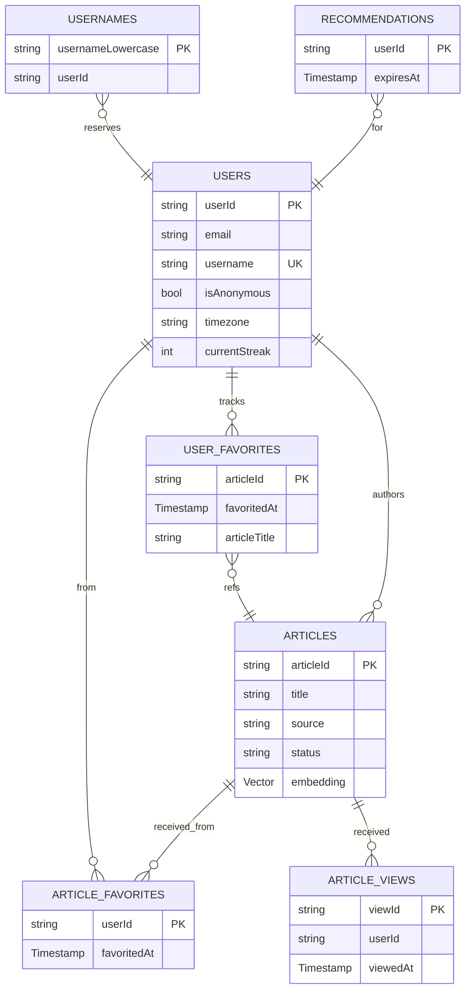

# Symmetry News — Database Schema

> Source of truth for Firestore + Cloud Storage layout.
> Maps to: `backend/.firebaserc` → `symmetry-news-test` (us-central1 / nam5).
> Region is **locked**: Vector Search requires `nam5` or `eur3` — cannot be changed post-creation.
> Requires: `cloud_firestore ^5.4.0` (native Vector field type for `embedding`).

---

## Conventions

- **Field markers**: `REQUIRED` / `OPTIONAL` / `FUTURE`
- **Types**: `string`, `number`, `bool`, `Timestamp`, `GeoPoint`, `Vector`, `reference`, `array<T>`
- All `Timestamp` fields are server-side via `FieldValue.serverTimestamp()` unless explicitly noted.
- All counters are denormalized; the truth-source is a reconciliation Cloud Function, not the client.
- `FUTURE` fields are documented to reserve the name — they are NOT created by this change.

---

## Collections Diagram



---

## Collections

### `users/{userId}`

Auth-derived, profile, streak, and counter fields for every registered user.

| Field | Type | Marker | Notes |
|-------|------|--------|-------|
| `email` | string | REQUIRED (after auth conversion) | from FirebaseAuth |
| `displayName` | string | REQUIRED (after auth conversion) | |
| `photoURL` | string | OPTIONAL | URL to Storage `media/users/{userId}/avatar.jpg` or external |
| `providerId` | string | REQUIRED | enum: `"google.com"` \| `"password"` \| `"anonymous"` |
| `username` | string | REQUIRED (after auth conversion) | unique, validated against `usernames/{lowercase}` |
| `bio` | string | OPTIONAL | maxLength 280 |
| `verified` | bool | REQUIRED | default `false` |
| `createdAt` | Timestamp | REQUIRED | server-side |
| `isAnonymous` | bool | REQUIRED | `true` for anonymous users, `false` after identity conversion |
| `timezone` | string | REQUIRED | IANA tz id, e.g. `"America/Mexico_City"` — user's local timezone, NOT UTC |
| `currentStreak` | number | REQUIRED | default 0; resets at 00:00 in user-local time |
| `longestStreak` | number | REQUIRED | default 0 |
| `lastPublishDate` | string | OPTIONAL | `YYYY-MM-DD` in user's timezone (not UTC) |
| `articlesPublished` | number | REQUIRED | denormalized counter |
| `totalReads` | number | REQUIRED | denormalized counter |
| `totalFavoritesReceived` | number | REQUIRED | denormalized counter |

**Field count**: 16

---

### `articles/{articleId}`

Core content document. Groups: NewsAPI parity, Symmetry-aligned, authorship, source, AI, lifecycle, engagement.

**Naming convention for cross-collection references**: FK fields are named after the target collection (e.g., `userId` for `users/{userId}`). Denormalized snapshot fields share the same prefix (`userDisplayName`, `userPhotoUrl`). Role prefixes (e.g., `authorId`) are reserved for documents that reference the same collection from multiple distinct roles. See engram observation #403.

| Field | Type | Marker | Notes |
|-------|------|--------|-------|
| `title` | string | REQUIRED | 5..200 chars |
| `description` | string | REQUIRED | 20..500 chars |
| `content` | string | REQUIRED | minLength 50 |
| `url` | string | OPTIONAL | external URL for newsapi-sourced articles |
| `urlToImage` | string | REQUIRED | mandatory thumbnail; points to Storage path or external URL |
| `publishedAt` | Timestamp | REQUIRED | server-side |
| `userId` | reference | REQUIRED | FK → `users/{userId}` — Firebase Auth UID of the article author |
| `userDisplayName` | string | REQUIRED | denormalized from `users/{userId}.displayName`; see [Open Questions](#open-questions) |
| `userPhotoUrl` | string | OPTIONAL | denormalized from `users/{userId}.photoURL` |
| `source` | string | REQUIRED | enum: `"journalist"` \| `"newsapi"` |
| `category` | string | REQUIRED | enum: `"fitness"` \| `"news"` \| `"lifestyle"` \| `"tech"` \| `"other"` |
| `tags` | array\<string\> | OPTIONAL | maxItems 10 |
| `language` | string | REQUIRED | ISO 639-1 (e.g. `"es"`, `"en"`) |
| `readingTimeMinutes` | number | REQUIRED | calculated by Cloud Function on write |
| `location` | GeoPoint | OPTIONAL | |
| `embedding` | VectorValue (768 floats) | yes | Populated by `embedArticleOnWrite` Cloud Function within ~30s after publish. Absent on docs that have never reached `status='published'`. |
| `embeddingSourceHash` | string | yes | sha256 hex of `title  description  content` (Start-of-Header separator, full text, pre-truncation). Used by the trigger for idempotency: skips re-embedding when source text is unchanged. |
| `embeddingProvider` | string | yes | Identifier for the embedding model in use, e.g. `'gemini-text-embedding-004'`. Useful when migrating between providers. |
| `embeddingDimensions` | number | yes | Vector length, e.g. `768`. Must match the active provider AND the deployed vector index. |
| `status` | string | REQUIRED | enum: `"published"` \| `"archived"` |
| `createdAt` | Timestamp | REQUIRED | server-side |
| `updatedAt` | Timestamp | REQUIRED | server-side, updated on every write |
| `viewCount` | number | REQUIRED | denormalized, default 0 |
| `favoriteCount` | number | REQUIRED | denormalized, default 0 |
| `isDeleted` | bool | REQUIRED | default `false`; set to `true` on soft delete — document is never hard-deleted |
| `deletedAt` | Timestamp | OPTIONAL | set to `serverTimestamp()` when `isDeleted` transitions to `true`; `null` for live articles |
| `searchHitCount` | number | FUTURE (`ai-embeddings`) | default 0; incremented by semantic search Cloud Function |

**Field count**: 26 (note: `aiSummary` is excluded from main table — see [Future Fields](#future-fields))

#### Soft Delete

Articles are soft-deleted via the `isDeleted` flag rather than removed. This preserves the storage thumbnail (cheaper to keep than to garbage-collect), enables future "trash" recovery, and makes accidental deletions reversible. Hard deletes are blocked by Firestore rules (`allow delete: if false`). The client transitions an article to deleted by calling `update({isDeleted: true, deletedAt: serverTimestamp()})`. Feed and "my articles" queries filter `isDeleted == false`.

#### Vector Field Justification

The `embedding` field uses the native `Vector` type from `cloud_firestore ^5.4.0` (NOT `List<double>` or `array<number>`). This is required to use Firestore's `findNearest` API for semantic search and recommendations.

| Property | Value |
|----------|-------|
| Dimensions | 768 |
| Generator | Gemini `text-embedding-004` |
| Distance metric | Cosine similarity |
| SDK floor | `cloud_firestore ^5.4.0` |
| Cost | ~6 KB per document |

Downgrading the SDK below `^5.4.0` would break `embedding` serialization — this is a hard prerequisite.

---

### `articles/{articleId}/favorites/{userId}`

Write path for favoriting an article. Document ID is the `userId`.

| Field | Type | Marker | Notes |
|-------|------|--------|-------|
| `userId` | string | REQUIRED | mirror of doc id |
| `favoritedAt` | Timestamp | REQUIRED | server-side |

---

### `users/{userId}/favorites/{articleId}` (mirror)

Mirror collection for efficient "my favorites" queries. Document ID is the `articleId`.

| Field | Type | Marker | Notes |
|-------|------|--------|-------|
| `articleId` | string | REQUIRED | mirror of doc id |
| `favoritedAt` | Timestamp | REQUIRED | server-side |
| `articleTitle` | string | REQUIRED | denormalized for list display |
| `articleThumbnailURL` | string | REQUIRED | denormalized; avoids fan-out on list render |

**Mirror rationale**: `articles/{id}/favorites/{userId}` enables a single subcollection scan for "who favorited this article". The mirror at `users/{uid}/favorites/{articleId}` enables a single subcollection scan for "my favorites", with `articleTitle` and `articleThumbnailURL` denormalized so the list renders without a second fan-out read into `articles/`.

Cost: **2 writes per favorite toggle** (one to each path, in a single Firestore batch — see `article-upload`). Acceptable because favorites are low-frequency relative to reads, which dominate.

---

### `articles/{articleId}/views/{viewId}`

Per-read event document. Aggregated into `articles/{articleId}.viewCount` by a Cloud Function.

| Field | Type | Marker | Notes |
|-------|------|--------|-------|
| `userId` | string | OPTIONAL | absent for anonymous reads (see locked decision: anonymous auth) |
| `viewedAt` | Timestamp | REQUIRED | server-side |
| `readDurationSeconds` | number | REQUIRED | client-reported |
| `completed` | bool | REQUIRED | `true` if user scrolled to end of article |

**Aggregation**: A Cloud Function (scoped to the `analytics-dashboard` change) reads this subcollection and writes the aggregate into `articles/{articleId}.viewCount`. The aggregator itself is **out of scope** for this change.

---

### `recommendations/{userId}` (single doc per user)

One document per user — not a subcollection. Replaced entirely on each recommendation generation.

| Field | Type | Marker | Notes |
|-------|------|--------|-------|
| `articleIds` | array\<reference\> | REQUIRED | ranked list, max 20 refs → `articles/{articleId}` |
| `generatedAt` | Timestamp | REQUIRED | server-side |
| `userEmbedding` | Vector | FUTURE (`ai-embeddings`) | 768 dims, averaged from user's read history |
| `expiresAt` | Timestamp | REQUIRED | Firestore TTL policy field (24h); NOT deleted client-side |

**TTL note**: Expiry is enforced by a **Firestore TTL policy** configured on the `expiresAt` field — not by client-side deletion. Configure at collection-group level in the Firebase console (or via `firestore.indexes.json` in `ai-embeddings`). Fresh recommendations are generated when the user reads new articles; 24h staleness is acceptable.

---

### `usernames/{usernameLowercase}` (uniqueness ledger)

Doc id is `username.toLowerCase()`. Existence of this document enforces case-insensitive username uniqueness.

| Field | Type | Marker | Notes |
|-------|------|--------|-------|
| `userId` | string | REQUIRED | back-ref → `users/{userId}` |
| `reservedAt` | Timestamp | REQUIRED | server-side |

The document is **create-only, never updated**. Case-insensitive uniqueness is enforced by a `create` rule in `auth` (deferred). The display-form username lives in `users/{userId}.username`.

---

### Excluded from Firestore

#### `analytics_events` — NOT in Firestore

Raw analytics events **MUST NOT** be stored in Firestore.

- **Route to**: Firebase Analytics (BigQuery export configurable later).
- **Rationale**: Unbounded write volume at scale makes Firestore cost-prohibitive for raw event capture. Firebase Analytics is purpose-built for funnel and retention analysis and provides BigQuery export out of the box.

#### `users/{userId}/drafts/*` — NOT in Firestore

Article drafts live in local **Floor SQLite** only (offline-first). They are never written to Firestore during drafting. Only on `publish` does a document land in `articles/`.

- **Rationale**: Paid writes for transient, device-local state is wasteful. Offline-first is preserved by keeping drafts in local storage.

---

## Storage Layout

Firestore stores only the URL (or path reference) — the binary lives in Cloud Storage. This is **non-negotiable** per locked architecture rules.

| Path | Purpose | Notes |
|------|---------|-------|
| `media/articles/{articleId}/thumbnail.jpg` | Original cropped 16:9 thumbnail | uploaded by client |
| `media/articles/{articleId}/thumbnail_thumb.jpg` | 200×112 generated variant | created by Cloud Function on upload (scoped to `article-upload`) |
| `media/users/{userId}/avatar.jpg` | User profile picture | client-uploaded |

`articles/{articleId}.urlToImage` and `users/{userId}.photoURL` reference these Storage paths (or external URLs). The binary is never stored in Firestore.

---

## Indexes

Composite indexes will be declared in `backend/firestore.indexes.json` by the changes that depend on them. This doc lists them so downstream changes know what to declare.

| Index | Type | Fields | Used by |
|-------|------|--------|---------|
| feed-by-recency | composite | `status` ASC, `publishedAt` DESC | home feed |
| my-articles | composite | `userId` ASC, `createdAt` DESC | "My Articles" screen |
| category-feed | composite | `category` ASC, `status` ASC, `publishedAt` DESC | category filter chips |
| my-favorites | implicit | subcollection ordered by `favoritedAt` DESC | `users/{uid}/favorites` listing |
| article-views | implicit | subcollection ordered by `viewedAt` DESC | analytics aggregator (`analytics-dashboard`) |
| vector-similarity | vector | `embedding`, cosine, 768 dims | `semanticSearch` + `recommendForUser` (added in `ai-embeddings`) |

**Deferral note**: `firestore.indexes.json` declarations are owned by the consuming changes (`article-upload`, `analytics-dashboard`, `ai-embeddings`), not by this change.

---

## Validation Sketch

This change documents the validation contract — it does **NOT** write `.rules` files. Full Firestore and Storage rules implementation is **explicitly deferred** to the `auth` and `article-upload` changes.

No `match` / `allow` Firestore rules syntax appears in this document.

| Rule | Field / Path | Implemented in |
|------|-------------|----------------|
| `title` must be 5..200 chars | `articles.title` | Firestore rules — `article-upload` |
| `description` must be 20..500 chars | `articles.description` | Firestore rules — `article-upload` |
| `content` must be ≥50 chars | `articles.content` | Firestore rules — `article-upload` |
| `urlToImage` must not be empty | `articles.urlToImage` | Firestore rules — `article-upload` |
| `userId == request.auth.uid` on write | `articles.userId` | Firestore rules — `article-upload` |
| `source == "journalist"` for client writes | `articles.source` | Firestore rules — `article-upload` |
| `users/{uid}` writable only by owner | `users/{userId}` | Firestore rules — `auth` |
| `usernames/{username}` create-only; `userId == request.auth.uid` | `usernames/{usernameLowercase}` | Firestore rules — `auth` |
| `media/articles/{articleId}/*` writable only by article owner | Storage path | Storage rules — `article-upload` |
| `media/users/{userId}/avatar.jpg` writable only by owner | Storage path | Storage rules — `auth` |

---

## Locked Decisions Citation Map

Every locked decision in `project/architecture-decisions` maps to a concrete schema element.

| Locked decision | Schema implementation |
|-----------------|----------------------|
| **us-central1 / nam5 region** | Doc header banner; vector index uses cosine 768 dim only because `nam5` supports Vector Search — region cannot change post-creation |
| **Anonymous auth enabled** | `users.isAnonymous` field; `users.providerId == "anonymous"` enum value; `views.userId` OPTIONAL (anonymous reads produce view records without a `userId`) |
| **Streak timezone = user's local IANA id** | `users.timezone` stores IANA id (e.g. `"America/Mexico_City"`); `users.lastPublishDate` is `YYYY-MM-DD` in local timezone, NOT UTC |
| **Optimistic UI updates** | `articles.viewCount` and `articles.favoriteCount` are denormalized — the client increments them locally for instant feedback before Firestore confirms. A Cloud Function reconciles from `views/` and `favorites/` subcollections to correct drift. Counters are NOT client-trusted at read. |

---

## Open Questions

All three questions are resolved for implementation.

1. **Denormalize `articles.userDisplayName` (display name) or resolve via `userId`?**
   **Chosen: denormalize.** Reads dominate writes; `displayName` changes are rare; saves a `users/` fan-out per article in the feed. Trade-off: when a user changes their `displayName`, a Cloud Function must back-fill `articles` where `userId == uid`. Acceptable cost.

2. **Lowercase-normalize `users.username`?**
   **Chosen: yes.** The doc id of `usernames/{usernameLowercase}` is the lowercase form; the display form is stored in `users.username`. Case-insensitive uniqueness is enforced by the existence rule on `usernames/{lowercase}` (create-only, no update).

3. **TTL on `recommendations`**
   **Chosen: 24h.** Recommendations recompute when the user reads new articles; fresh data wins. Configured via Firestore TTL policy on the `expiresAt` field — not client-side deletion.

---

## Future Fields

These fields are **documented to reserve names** — they are NOT created by this change. Each cites the SDD change that will introduce it.

### `users`

| Field | Type | Owning change |
|-------|------|---------------|
| `pushTokens` | array\<string\> | `notifications` (FCM tokens) |
| `featureFlags` | map | `remote-config` (Remote Config overrides) |
| `pinnedArticleIds` | array\<reference\> | `profile-v2` |

### `articles`

| Field | Type | Owning change |
|-------|------|---------------|
| `searchHitCount` | number | `ai-embeddings` |
| `aiSummary` | string | `ai-summarization` (future Gemini summary) |
| `editHistory` | subcollection | `article-edit` (revision history) |

### `recommendations`

| Field | Type | Owning change |
|-------|------|---------------|
| `userEmbedding` | Vector (768 dims) | `ai-embeddings` (averaged from read history) |
| `feedbackSignals` | map | `ai-embeddings` (like/dislike per article) |

---

## Embedding lifecycle

Articles gain four embedding-related fields when the `embedArticleOnWrite`
Cloud Function fires (or when an admin runs `backfillEmbeddings`):

- `embedding` — a 768-dimension vector produced by the active embedding
  provider (currently Gemini `text-embedding-004`).
- `embeddingSourceHash` — sha256 hex of the concatenated
  `title  description  content` text (Start-of-Header separator, full
  text, pre-truncation). The trigger skips re-embedding when this hash
  matches the doc's stored hash, preventing write loops and unnecessary
  API calls.
- `embeddingProvider` — identifier of the model in use. Future provider
  swaps (OpenAI, Voyage, Anthropic) update this value and trigger a
  full backfill if the dimension changes.
- `embeddingDimensions` — vector length. MUST match both the active
  provider and the deployed Firestore vector index.

The trigger is idempotent and only embeds articles where
`status == 'published'` and `isDeleted == false`. Soft-deleted articles
keep their embedding data on disk but are excluded from search results
by the `searchArticles` callable.

### Provider abstraction

Embeddings are produced via a TypeScript `EmbeddingProvider` interface in
`backend/functions/src/ai/embedding_provider.ts`. The active provider is
selected by a single factory function (`backend/functions/src/ai/factory.ts`).
Switching providers (Gemini → OpenAI / Voyage / Anthropic) is a one-file
change to the factory, plus a re-deploy and a backfill if the new
provider's vector dimension differs from the old one. Business logic
inside the trigger, the search callable, and the backfill callable
depends only on the interface — never on the provider's SDK directly.
This convention is documented in engram observation #408 and applies
to any future AI/ML integration.

### Vector index

A Firestore vector index is declared in `backend/firestore.indexes.json`:

```json
{
  "vectorIndexes": [
    {
      "collectionGroup": "articles",
      "queryScope": "COLLECTION",
      "fieldPath": "embedding",
      "vectorConfig": { "dimension": 768, "flat": {} }
    }
  ]
}
```

The index is required by `findNearest` queries used in the
`searchArticles` callable. Index build can take several minutes after
deploy on a populated collection.
